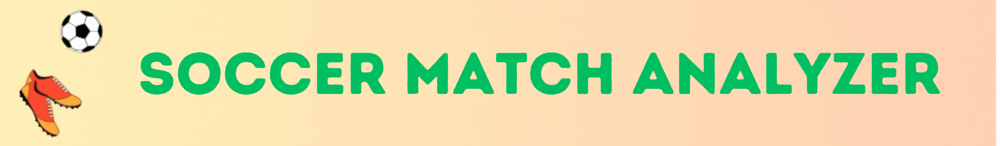

<div align="center">



This project is a computer vision-based analysis tool for soccer matches. It leverages advanced image processing techniques and machine learning models to analyze and extract meaningful insights from soccer match videos, such as player tracking, ball movement, and event detection.

---


---


## Player and Team Tracking

Detects players on the field and assigns each to their team color for easy identification. Referees are distinguished separately. Additionally, player numbers can be linked, ball tracking is active, and current ball possession is shown in real-time.


---

##  How to Try?

<div align="left">
  
```# Clone this repository
$ git clone https://github.com/temashidzo/soccer_analyzer.git

# Go into the repository
$ cd soccer_analyzer

# Install dependencies
$ pip install -r requirements.txt

# Add your input video in MP4 format to the input_videos folder

# Specify the input video file name in the main file

# Run the main file
$ python main.py

# The processed video will be saved in the output_videos folder
```

</div>

---


## 🧑‍💻 For more detailed instructions, contact me on [Telegram](https://t.me/temashidzo)

</div>
